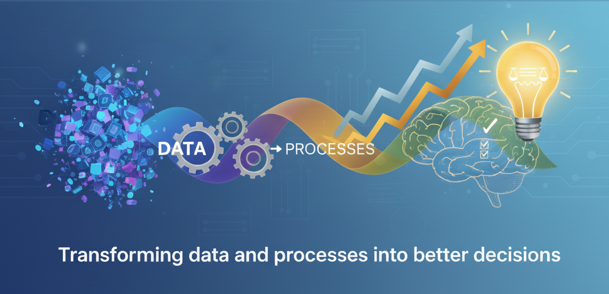

  

<h1 align="center">Manolo Arriola</h1>

  🚀 <b>Technical Project Manager</b> • 📊 <b>Data & Backend Developer</b> • 📈 <b>Business Analytics</b> 
  Turning operational complexity into structured, data-driven systems.

  

---

## ✅ Hybrid Technical Profile (30-second scan)

- Leads projects end-to-end in structured operational environments  
- Builds backend solutions (Python/Flask) when execution needs code, not slides  
- Designs financial + risk decision models to support leadership decisions  
- Converts messy processes into scalable systems and dashboards  

---

## 🛠 Stack (Core)

**Backend:** Python • Flask • SQLite • REST • Postman  
**Analytics:** Pandas • Power BI • Advanced Excel Modeling  
**Workflow:** Git • GitHub • VS Code  

---

## 🏆 Certifications

  
  &nbsp;&nbsp;&nbsp;&nbsp;
  
  &nbsp;&nbsp;&nbsp;&nbsp;
  

## 🚀 Featured Projects

### 📊 Operational Risk Analyzer
Decision-support tool that simulates risk exposure scenarios and clarifies operational vulnerability for executive-level evaluation.

### 🌐 REST API — Fertilizer Catalog
Flask + SQLite API demonstrating filtering, structured endpoints, and database-backed queries.

### 💰 Financial Projection Engine
CLI simulator for ROI, margin scenarios, and cash-flow projections under multiple assumptions.

---

## 🔭 Current Focus

- Advanced SQL & Query Optimization  
- Backend Architecture Patterns  
- Data Engineering Foundations  
- PMP Certification  
