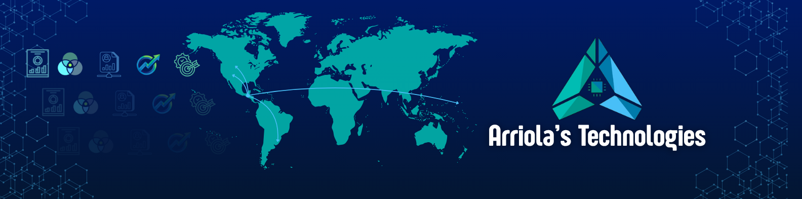

<!-- =========================
     EXECUTIVE PORTFOLIO HEADER
     ========================= -->

  

<h1 align="center">Manolo Arriola</h1>

  🚀 <b>Technical Project Manager</b> • 📊 <b>Data & Backend Developer</b> • 📈 <b>Business Analytics</b> 
  Turning operational complexity into structured, data‑driven systems.

  
  
  

<!-- =========================
     GITHUB STREAK
     ========================= -->

  

<!-- =========================
     EXECUTIVE SUMMARY
     ========================= -->

<h2>✅ Executive Summary</h2>

<ul>
  <li><b>Hybrid Technical Leader:</b> I lead projects end‑to‑end and build the technical solution when execution requires code—not slides.</li>
  <li><b>Decision Systems:</b> risk + finance + operations turned into clear models, dashboards, and automation.</li>
  <li><b>Operational Credibility:</b> 10+ years leading structured teams (150+ personnel) and implementing reporting systems for leadership.</li>
</ul>

<!-- =========================
     VALUE DRIVERS
     ========================= -->

<h2>🎯 Value Drivers</h2>

<table>
  <tr>
    <td><b>Execution</b> • Scope → delivery • Stakeholders & cadence • Repeatable processes</td>
    <td><b>Data</b> • KPI + dashboards • Scenario modeling • Decision clarity</td>
    <td><b>Technology</b> • Flask APIs • SQLite/SQL design • Automation systems</td>
  </tr>
</table>

<!-- =========================
     STACK (CORE)
     ========================= -->

<h2 id="-stack-core">🛠 Stack (Core)</h2>

<b>Backend:</b> Python • Flask • SQLite • REST • Postman 
<b>Analytics:</b> Pandas • Power BI • Advanced Excel Modeling 
<b>Workflow:</b> Git • GitHub • VS Code

<!-- =========================
     CERTIFICATIONS
     ========================= -->

<h2 id="-certifications">🏆 Certifications</h2>

  Networking • Project Management • Python Development

  

  

  

  

<!-- =========================
     FEATURED PROJECTS
     ========================= -->

<h2 id="-featured-projects">🚀 Featured Projects</h2>

<h3>📊 Operational Risk Analyzer</h3>

Decision‑support tool that simulates risk exposure scenarios and clarifies operational vulnerability for leadership evaluation.

<ul>
  <li>Scenario modeling to compare exposures and controls</li>
  <li>Structured outputs for executive review</li>
</ul>

<h3>🌐 REST API — Fertilizer Catalog</h3>

Flask + SQLite API demonstrating filtering, structured endpoints, and database‑backed queries.

<ul>
  <li>Query‑driven endpoints (brand/type/cost filters)</li>
  <li>Clean API design + backend structure</li>
</ul>

<h3>💰 Financial Projection Engine</h3>

CLI simulator for ROI, margin scenarios, and cash‑flow projections under multiple assumptions.

<ul>
  <li>ROI + margin sensitivity analysis</li>
  <li>Decision‑ready outputs for viability review</li>
</ul>

<!-- =========================
     CURRENT FOCUS
     ========================= -->

<h2>🔭 Current Focus</h2>

<ul>
  <li>Advanced SQL & Query Optimization</li>
  <li>Backend Architecture Patterns</li>
  <li>Data Engineering Foundations</li>
  <li>PMP Certification</li>
</ul>
